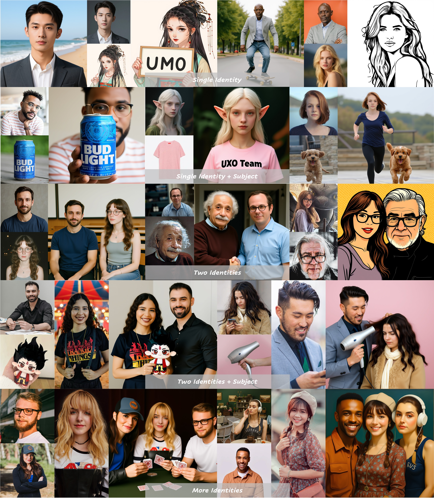

<h3 align="center">
    
    </br>
    UMO: Scaling Multi-Identity Consistency for Image Customization
</br> via Matching Reward
</h3>

<p align="center"> 
<a href="https://github.com/bytedance/UMO"></a> 
<!-- <a href="https://bytedance.github.io/UMO/"></a>  -->
<!-- <a href="https://arxiv.org/abs/25xx.xxxxx"></a> -->
<a href="https://huggingface.co/bytedance-research/UMO"></a>
<!-- <a href="https://huggingface.co/spaces/bytedance-research/UMO-FLUX"></a> -->
</p>

><p align="center"> <span style="color:#137cf3; font-family: Gill Sans">Yufeng Cheng,</span><sup></sup></a> <span style="color:#137cf3; font-family: Gill Sans">Wenxu Wu,</span><sup></sup></a> <span style="color:#137cf3; font-family: Gill Sans">Shaojin Wu,</span><sup></sup></a> <span style="color:#137cf3; font-family: Gill Sans">Mengqi Huang,</span><sup></sup></a> <span style="color:#137cf3; font-family: Gill Sans">Fei Ding,</span><sup></sup></a> <span style="color:#137cf3; font-family: Gill Sans">Qian He</span></a> <br> 
><span style="font-size: 16px">UXO Team</span><br>
><span style="font-size: 16px">Intelligent Creation Lab, Bytedance</span></p>

## 🔥 News
- 2025.09.08 🔥 The inference and evaluation [code](https://github.com/bytedance/UMO) of UMO is released.

## 📖 Introduction
Recent advancements in image customization exhibit a wide range of application prospects due to stronger customization capabilities. However, since we humans are more sensitive to faces, a significant challenge remains in preserving consistent identity while avoiding identity confusion with multi-reference images, limiting the identity scalability of customization models. To address this, we present *UMO*, a **U**nified **M**ulti-identity **O**ptimization framework, designed to maintain high-fidelity identity preservation and alleviate identity confusion with scalability. With "multi-to-multi matching" paradigm, UMO reformulates multi-identity generation as a global assignment optimization problem and unleashes multi-identity consistency for existing image customization methods generally through reinforcement learning on diffusion models. To facilitate the training of UMO, we develop a scalable customization dataset with multi-reference images, consisting of both synthesised and real parts. Additionally, we propose a new metric to measure identity confusion. Extensive experiments demonstrate that UMO not only improves identity consistency significantly, but also reduces identity confusion on several image customization methods, setting a new state-of-the-art among open-source methods along the dimension of identity preserving.

<p align="center">
    
</p>

## 📌 TODO
- [ ] Release model on huggingface
- [ ] Release huggingface demo
- [ ] Release project page
- [ ] Release training code

## ⚡️ Quick Start

### 🔧 Requirements and Installation

```bash
# 1. Clone the repo with submodules: UNO & OmniGen2
git clone --recurse-submodules git@github.com:bytedance/UMO.git
cd UMO
```

#### UMO requirements based on UNO

```bash
# 2.1 (Optional, but recommended) Create a clean virtual Python 3.11 environment
python3 -m venv venv/UMO_UNO
source venv/UMO_UNO/bin/activate

# 3.1 Install submodules UNO requirements as:
# https://github.com/bytedance/UNO?tab=readme-ov-file#-requirements-and-installation

# 4.1 Install UMO requirements
pip install -r requirements.txt
```

#### UMO requirements based on OmniGen2

```bash
# 2.2 (Optional, but recommended) Create a clean virtual Python 3.11 environment
python3 -m venv venv/UMO_OmniGen2
source venv/UMO_OmniGen2/bin/activate

# 3.2 Install submodules OmniGen2 requirements as:
# https://github.com/VectorSpaceLab/OmniGen2?tab=readme-ov-file#%EF%B8%8F-environment-setup

# 4.2 Install UMO requirements
pip install -r requirements.txt
```

#### UMO checkpoints download
```bash
# pip install huggingface_hub hf-transfer
export HF_HUB_ENABLE_HF_TRANSFER=1 # use hf_transfer to speedup
# export HF_ENDPOINT=https://hf-mirror.com # use mirror to speedup if necessary

repo_name="bytedance-research/UMO"
local_dir="models/"$repo_name

huggingface-cli download --resume-download $repo_name --local-dir $local_dir
```

### 🌟 Gradio Demo

```bash
# UMO (based on UNO)
python3 demo/UNO/app.py --lora_path models/bytedance-research/UMO/UMO_UNO.safetensors

# UMO (based on OmniGen2)
python3 demo/OmniGen2/app.py --lora_path models/bytedance-research/UMO/UMO_OmniGen2.safetensors
```

### ✍️ Inference

#### UMO (based on UNO) inference on XVerseBench

```bash
# single subject
accelerate launch eval/UNO/inference_xversebench.py \
    --eval_json_path projects/XVerse/eval/tools/XVerseBench_single.json \
    --num_images_per_prompt 4 \
    --width 768 \
    --height 768 \
    --save_path output/XVerseBench/single/UMO_UNO \
    --lora_path models/bytedance-research/UMO/UMO_UNO.safetensors
    

# multi subject
accelerate launch eval/UNO/inference_xversebench.py \
    --eval_json_path projects/XVerse/eval/tools/XVerseBench_multi.json \
    --num_images_per_prompt 4 \
    --width 768 \
    --height 768 \
    --save_path output/XVerseBench/multi/UMO_UNO \
    --lora_path models/bytedance-research/UMO/UMO_UNO.safetensors
```

#### UMO (based on UNO) inference on OmniContext

```bash
accelerate launch eval/UNO/inference_omnicontext.py \
    --eval_json_path OmniGen2/OmniContext \
    --width 768 \
    --height 768 \
    --save_path output/OmniContext/UMO_UNO \
    --lora_path models/bytedance-research/UMO/UMO_UNO.safetensors
```

#### UMO (based on OmniGen2) inference on XVerseBench

```bash
# single subject
accelerate launch -m eval.OmniGen2.inference_xversebench \
    --model_path OmniGen2/OmniGen2 \
    --model_name UMO_OmniGen2 \
    --test_data projects/XVerse/eval/tools/XVerseBench_single.json \
    --result_dir output/XVerseBench/single \
    --num_images_per_prompt 4 \
    --disable_align_res \
    --lora_path models/bytedance-research/UMO/UMO_OmniGen2.safetensors

# multi subject
accelerate launch -m eval.OmniGen2.inference_xversebench \
    --model_path OmniGen2/OmniGen2 \
    --model_name UMO_OmniGen2 \
    --test_data projects/XVerse/eval/tools/XVerseBench_multi.json \
    --result_dir output/XVerseBench/multi \
    --num_images_per_prompt 4 \
    --disable_align_res \
    --lora_path models/bytedance-research/UMO/UMO_OmniGen2.safetensors
```

#### UMO (based on OmniGen2) inference on OmniContext

```bash
accelerate launch -m eval.OmniGen2.inference_omnicontext \
    --model_path OmniGen2/OmniGen2 \
    --model_name UMO_OmniGen2 \
    --test_data OmniGen2/OmniContext \
    --result_dir output/OmniContext \
    --num_images_per_prompt 1 \
    --disable_align_res \
    --lora_path models/bytedance-research/UMO/UMO_OmniGen2.safetensors
```

### 🔍 Evaluation

#### Evaluation on XVerseBench

To make evaluation on XVerseBench, please get the dependencies and models as [XVerse](https://github.com/bytedance/XVerse?tab=readme-ov-file#requirements-and-installation) first.

Then run the script:

```bash
# UMO (based on UNO) single subject
bash scripts/eval_xversebench.sh single output/XVerseBench/single/UMO_UNO

# UMO (based on UNO) multi subject
bash scripts/eval_xversebench.sh multi output/XVerseBench/multi/UMO_UNO


# UMO (based on OmniGen2) single subject
bash scripts/eval_xversebench.sh single output/XVerseBench/single/UMO_OmniGen2

# UMO (based on OmniGen2) multi subject
bash scripts/eval_xversebench.sh multi output/XVerseBench/multi/UMO_OmniGen2
```

#### Evaluation on OmniContext

For original metrics (*i.e.*, PF, SC, Overall) in OmniContext, just follow [OmniContext](https://github.com/VectorSpaceLab/OmniGen2/tree/main/omnicontext#step3-evaluation).

For ID-Sim and ID-Conf metric, please run the script:

```bash
# UMO (based on UNO)
bash scripts/eval_id_omnicontext.sh UMO_UNO

# UMO (based on OmniGen2)
bash scripts/eval_id_omnicontext.sh UMO_OmniGen2
```


### 📌 Tips and Notes

Please note that UNO gets unstable results on parts of OmniContext due to the different prompt format with its training data ([UNO-1M](https://huggingface.co/datasets/bytedance-research/UNO-1M)), leading to similar issue with UMO based on it. To get better results with these two models, we recommend using description prompt instead of instruction one, using resolution 768~1024 instead of 512.

## 📄 Disclaimer
<p>
We open-source this project for academic research. The vast majority of images 
used in this project are either generated or licensed. If you have any concerns, 
please contact us, and we will promptly remove any inappropriate content. 
Our code is released under the Apache 2.0 License.
<br><br>This research aims to advance the field of generative AI. Users are free to 
create images using this tool, provided they comply with local laws and exercise 
responsible usage. The developers are not liable for any misuse of the tool by users.</p>

## 🚀 Updates
For the purpose of fostering research and the open-source community, we plan to open-source the entire project, encompassing training, inference, weights, etc. Thank you for your patience and support! 🌟


##  Citation
If UMO is helpful, please help to ⭐ the repo.

If you find this project useful for your research, please consider citing our paper:
<!-- ```bibtex
@article{wu2025less,
  title={Less-to-More Generalization: Unlocking More Controllability by In-Context Generation},
  author={Wu, Shaojin and Huang, Mengqi and Wu, Wenxu and Cheng, Yufeng and Ding, Fei and He, Qian},
  journal={arXiv preprint arXiv:2504.02160},
  year={2025}
}
``` -->
